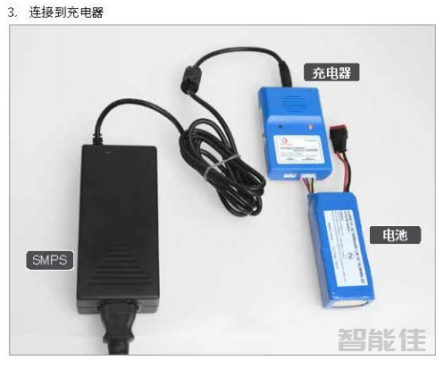
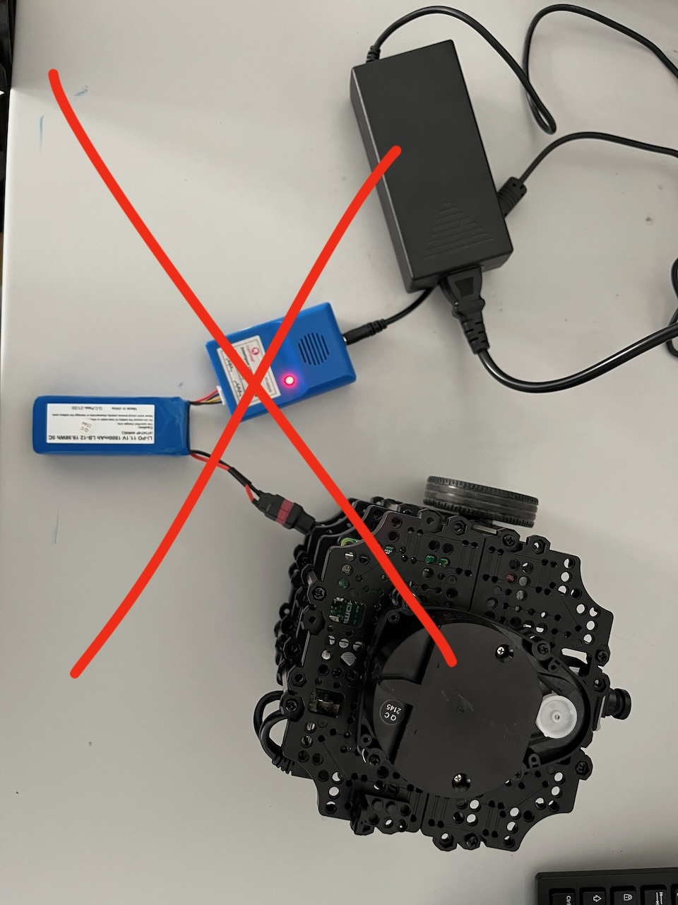
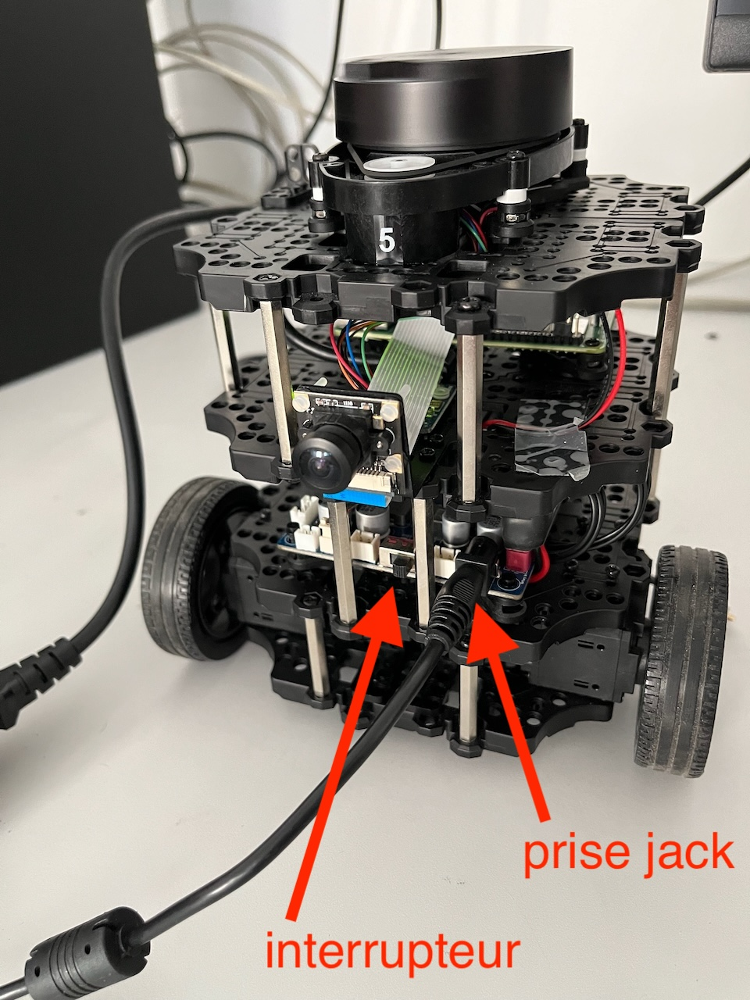
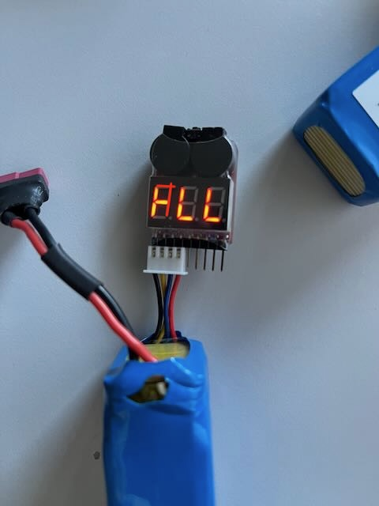
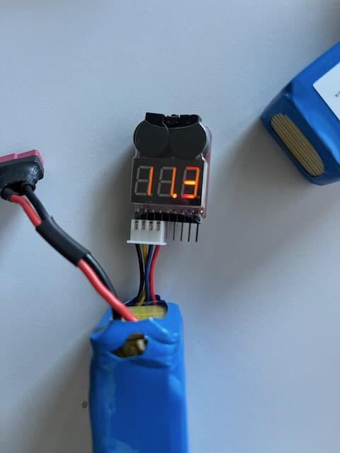
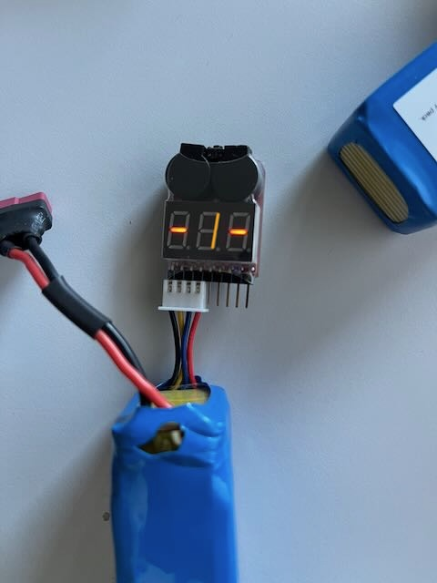
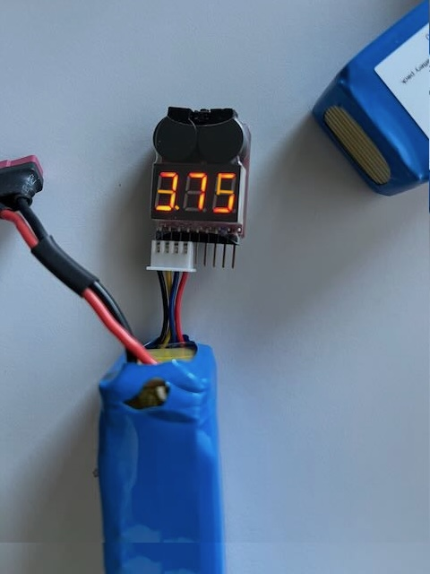
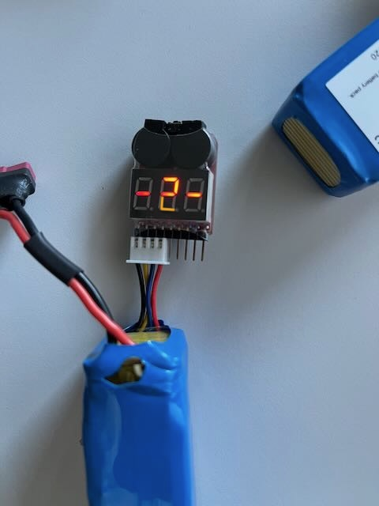

# TurtleBot3 Batteries
(Author: L. Cuvillon, derivative work from Brian Bingham)

The TurtleBot3 Burger is powered by an 11.1 V, 1800 mAh LiPo (lithium polymer) battery. The following notes will help you use LiPo batteries safely and effectively, without damaging them.

**Key voltages (3-cell pack)**

| Pack voltage | Per cell | Meaning |
|---|---|---|
| 12.6 V | 4.2 V | Fully charged (maximum) |
| 11.4 V | 3.8 V | Storage voltage (long-term storage) |
| 11.1 V | 3.7 V | Nominal voltage |
| 11.0 V | ≈ 3.67 V | TurtleBot3 low-voltage alarm: stop and recharge soon |
| 10.5 V | 3.5 V | Minimum at rest: recharge now |
| 10.0 V | ≈ 3.33 V | Absolute minimum, even under load: below this, the battery is damaged |

---

## Charging

- **Never leave a charging battery unattended.**
  - Although the risk is low, a damaged battery can catch fire. Charge it on a non-flammable surface, away from flammable objects.

- Always use one of the supplied balance chargers, or a LiPo charger.
- With the supplied charger (the blue one in the photo below), the battery is charged through its balance cable, which ensures that the three cells are evenly charged.
  - A **red LED** indicates that charging is in progress.
  - A **green LED** indicates that the battery is fully charged.
  - A **blinking red LED** indicates a short circuit or a faulty battery. **Stop charging immediately.**

  

- With a hobby LiPo charger, select the **LiPo 3S** (3 cells) mode, connect the balance cable, and set the **maximum charge current to 1.8 A** (1C for an 1800 mAh battery).

- **Never charge a swollen (puffy) or damaged battery.** Stop using it and dispose of it properly.

---

## Operation

- **Do not charge the battery while it is still connected to the robot.**
  - **Reason:** the charger cannot properly balance the three cells while the TurtleBot3 is drawing current.

  

- **Do not let the voltage drop below 10.0 V, to avoid damaging the battery pack.**
  - If a LiPo cell drops below about 3.5 V at rest (10.5 V for the pack), its internal chemistry is permanently damaged: the battery can no longer hold a full charge, its internal resistance increases, and it may even refuse to charge.
  - The voltage drops while the robot is drawing current and rises again at rest. So recharge as soon as the pack reaches 10.5 V at rest, and never let it drop below 10.0 V, even under load.

- When the TurtleBot3 is powered on, a low-voltage alarm sounds (beeps) below 11.0 V. When you hear it, stop the robot and recharge or replace the battery.

- Monitor the voltage during operation, for example with the ROS topic `/battery_state` (`voltage` field): `ros2 topic echo /battery_state`. This lets you:
  1. know how much time remains before the battery needs recharging,
  2. avoid over-discharging the battery pack.

- To replace the battery without interrupting operation, you can temporarily power the TurtleBot3 through the front power supply port while you swap the batteries.
  **However, do not power the robot with both the power supply and the battery at the same time for long periods.**

  

---

## Storage

- When not in use, batteries:
  - must be **disconnected** from the TurtleBot3 and from the charger, to avoid a slow discharge below the safety threshold;
  - should preferably be stored in a **metal box** (or a LiPo safety bag), in case of spontaneous combustion.

### Short term (up to 2 days)

- Batteries may be stored fully charged.
- Do **not** store batteries fully discharged: make sure that the pack voltage is at least 11.0 V.

### Long term (more than 2 days)

- Bring the pack to its **storage voltage of 11.4 V** (3.8 V per cell):
  - if the voltage is lower, charge the battery with the balance charger until it reaches 11.4 V (check with a [battery checker](#battery-checker));
  - if the voltage is higher, discharge the battery, either:
    1. by running the TurtleBot3 until the voltage reaches 11.4 V, or
    2. with a LiPo discharger.

  Many hobby LiPo chargers have a **Storage** mode that does this automatically.
- Check the voltage of stored batteries every few months, and bring them back to 11.4 V if needed.

---

## Appendix

### Battery checker

- Several battery checkers are available to monitor the battery voltage.
  They connect to the battery through its balance cable.

  - First, the total pack voltage is displayed:

    
    

  - Then, the number and voltage of each cell are displayed in turn. The three cells should have nearly the same voltage (within about 0.05 V):

    
    
    
