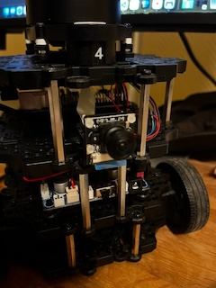
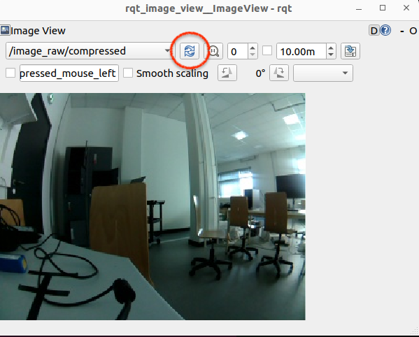
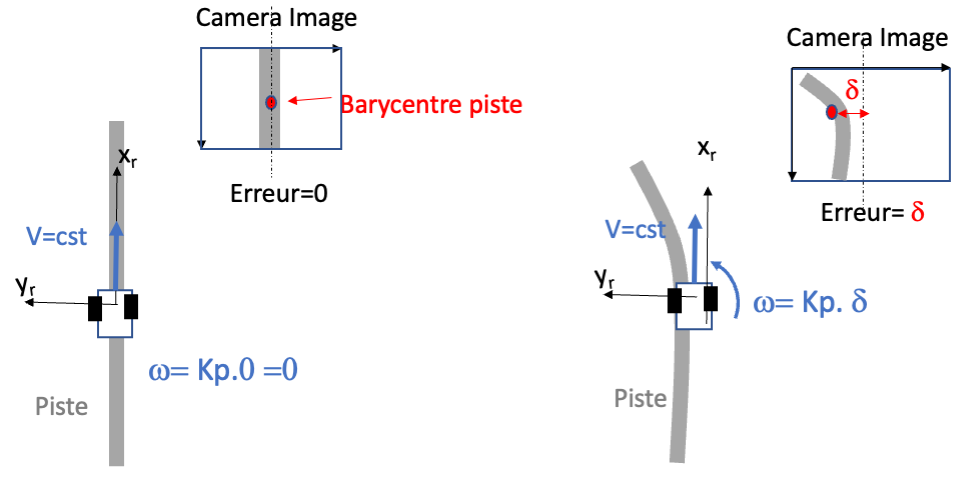
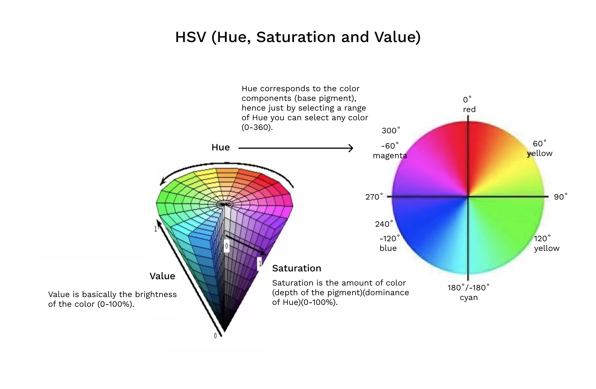
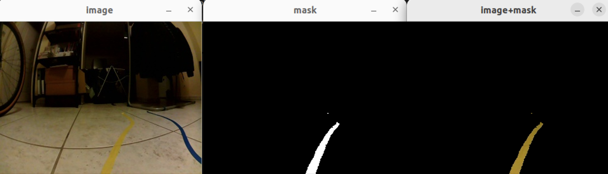
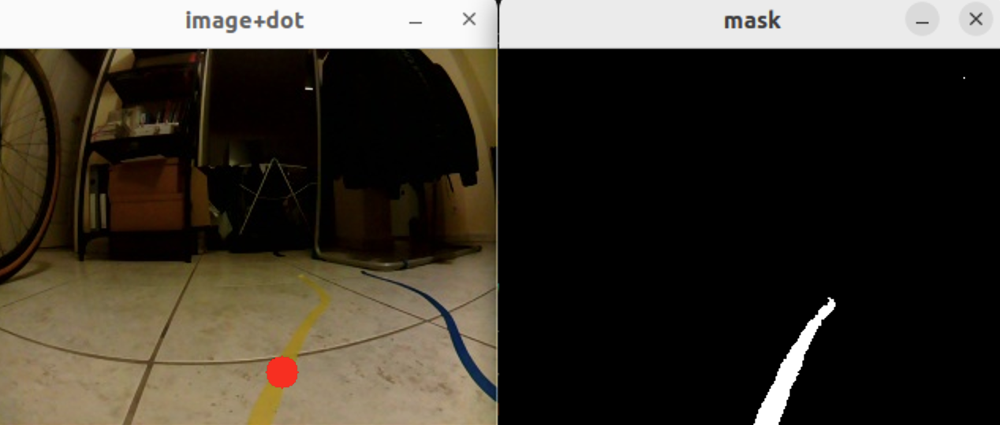
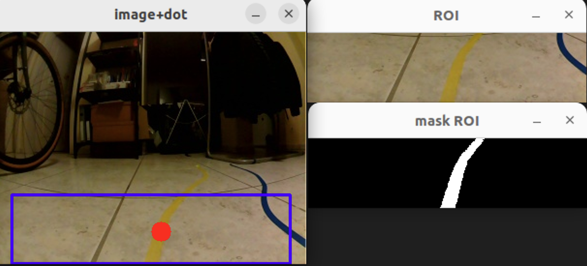
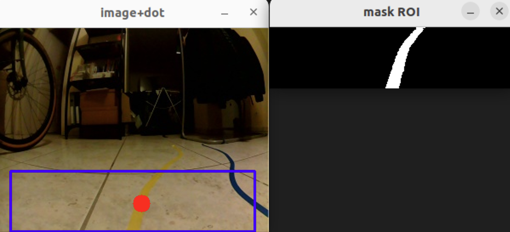
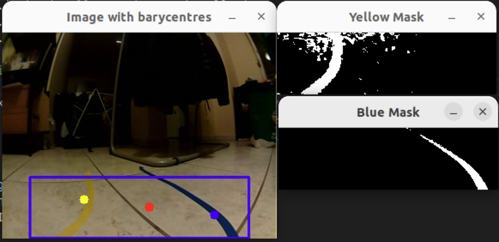

# Suivi de ligne et de piste par caméra avec le TurtleBot3

*[(English version here)](Line_track_following.md)*

Ce tutoriel montre comment faire suivre au TurtleBot3 une ligne de couleur, puis une piste formée de deux lignes de couleur, à l'aide de sa caméra.
Il propose une solution qui se veut plus accessible et simple que le suivi de piste proposée dans le projet [autonomous_driving](https://docs.robotis.com/docs/systems/turtlebot3/autonomous_driving/) du manuel officiel. 

Il suppose que :
- un TurtleBot3 fonctionnel est disponible, avec une caméra montée à l'avant du robot et branchée sur la Raspberry Pi (RPi) : une [caméra RPi fisheye (M)](https://www.waveshare.com/rpi-camera-m.htm), dont le large de champ du vue est bénéfique, ou une [caméra RPi v2](https://www.kubii.com/fr/cameras-capteurs/1653-module-camera-v2-8mp-kubii-652508442112.html?src=raspberrypi),
- la carte SD de la RPi du TurtleBot3 et le PC ont tous deux été configurés avec ROS 2 Humble,
- la carte SD de la RPi est configurée pour utiliser l'ancien pilote de caméra (*legacy*) et le paquet ROS `v4l2_camera` est installé, soit :
    - parce que vous utilisez l'image de carte SD prête à l'emploi, qui les inclut déjà ([Quick_installation_fr](Quick_installation_fr.md)),
    - soit parce que vous avez configuré la RPi vous-même comme décrit dans le manuel : [quick_start_guide/sbc_setup#raspberry-pi-camera](https://docs.robotis.com/docs/systems/turtlebot3/quick_start_guide/sbc_setup#raspberry-pi-camera).

Tous les scripts Python utilisés dans ce tutoriel se trouvent dans le dossier [src/](src/).


*Une caméra fisheye monté à l'avant du TB3*


**Sommaire**
1. [Test de la caméra](#1-test-de-la-caméra-paquet-ros-v4l2_camera)
2. [Un suiveur de ligne](#2-un-suiveur-de-ligne)
3. [Un suiveur de piste (deux lignes)](#3-un-suiveur-de-piste-deux-lignes--urmrc26)
4. [Annexe : intégrer le script Python dans un paquet ROS 2](#annexe--intégrer-le-script-python-dans-un-paquet-ros-2)


# 1. Test de la caméra (paquet ROS `v4l2_camera`)

L'essentiel du test de la caméra est décrit dans le manuel officiel ([quick_start_guide/sbc_setup#raspberry-pi-camera](https://docs.robotis.com/docs/systems/turtlebot3/quick_start_guide/sbc_setup#raspberry-pi-camera)). Il est repris ci-dessous.

## Sur le TurtleBot3 (RPi, via SSH)

1. Vérifiez que la caméra est détectée :
    ```sh
    v4l2-ctl --list-devices
    ```
    La commande doit afficher :
    ```
    mmal service 16.1 (platform:bcm2835-v4l2-0):
        /dev/video0
    ```
    > **Remarque :** `v4l2-ctl --all` affiche tous les paramètres modifiables de la caméra (exposition automatique, fréquence d'images, ...). Par exemple, `v4l2-ctl -p 10` règle la fréquence d'images à 10 images/s au lieu de la valeur par défaut (30 images/s ou plus).

2. Lancez le nœud de la caméra, qui diffuse à la fois les images brutes et compressées :
    ```sh
    ros2 run v4l2_camera v4l2_camera_node
    ```
    Il doit afficher :
    ```
    [INFO] [1790633826.244848025] [v4l2_camera]: Success
    [INFO] [1790633826.247136817] [v4l2_camera]: Starting camera
    [WARN] [1790633826.747098130] [v4l2_camera]: Image encoding not the same as requested output, performing possibly slow conversion: yuv422_yuy2 => rgb8
    [INFO] [1790633826.834411816] [v4l2_camera]: using default calibration URL
    [INFO] [1790633826.834613166] [v4l2_camera]: camera calibration URL: file:///home/ubuntu/.ros/camera_info/mmal_service_16.1.yaml
    [ERROR] [1790633826.834948385] [camera_calibration_parsers]: Unable to open camera calibration file [/home/ubuntu/.ros/camera_info/mmal_service_16.1.yaml]
    [WARN] [1790633826.835030513] [v4l2_camera]: Camera calibration file /home/ubuntu/.ros/camera_info/mmal_service_16.1.yaml not found
    ```
    Les lignes importantes sont `Success` et `Starting camera`. L'`ERROR` concernant le fichier de calibration manquant peut être ignorée : aucune calibration de la caméra n'est nécessaire dans ce tutoriel.

## Sur le PC

1. Vérifiez que les paquets nécessaires pour décompresser le flux vidéo (et pour convertir les images ROS en images OpenCV) sont installés :
    ```sh
    sudo apt install ros-humble-image-transport-plugins ros-humble-cv-bridge python3-opencv
    ```

2. Avec `v4l2_camera_node` en cours d'exécution sur le TurtleBot3, vérifiez que les topics de la caméra sont disponibles :
    ```sh
    ros2 topic list
    ```
    ```
    /camera_info
    /image_raw
    /image_raw/compressed
    /image_raw/compressedDepth
    /image_raw/theora
    /parameter_events
    /rosout
    ```
    Les topics `/image_raw` et `/image_raw/compressed` transportent respectivement le flux vidéo brut et le flux vidéo compressé.

3. Affichez l'image avec l'outil graphique `rqt` :
    ```sh
    rqt -s image_view
    ```
    (ou de façon équivalente `ros2 run rqt_image_view rqt_image_view`)

    Dans la fenêtre, sélectionnez le topic `/image_raw` ou `/image_raw/compressed`. Si un topic n'apparaît pas dans la liste, cliquez sur le bouton d'actualisation.

    

> **Important :** l'affichage prend du retard lorsque des images non compressées sont diffusées en Wi-Fi.
> **Utilisez toujours le flux vidéo compressé pendant les missions, pour ne pas saturer la bande passante Wi-Fi et ne pas retarder la vidéo.**

Pour réduire encore la bande passante, comme le recommande le manuel officiel, diminuez la résolution de l'image en lançant le nœud de la caméra sur le TurtleBot3 avec un paramètre supplémentaire :
```sh
ros2 run v4l2_camera v4l2_camera_node --ros-args -p image_size:=[320,240]
```
où `[320,240]` est la résolution de l'image (largeur, hauteur) en pixels.


# 2. Un suiveur de ligne

## Principe
Ici, la piste à suivre est une seule ligne de couleur (jaune) au sol.

Le robot avance à une **vitesse linéaire constante**. Sa **vitesse angulaire** dépend de la position de la ligne dans l'image de la caméra montée sur le robot :
- si la ligne est au centre de l'image, la distance entre la ligne et le centre de l'image est nulle, donc la vitesse angulaire est nulle et le robot va tout droit ;
- dans un virage, la ligne n'est plus au centre de l'image, donc le robot tourne avec une vitesse angulaire non nulle, proportionnelle à cette distance (commande proportionnelle).

### Schéma bloc et chaîne de traitement
Le schéma de commande général est le suivant :
- La Raspberry Pi (RPi) envoie au PC un flux vidéo compressé de sa caméra.
- Le PC :
    - décompresse le flux vidéo,
    - ne garde que la partie basse de l'image (le sol juste devant le robot),
    - détecte le centre (barycentre) de la ligne jaune par seuillage de couleur,
    - calcule la distance horizontale entre le centre de l'image et la ligne, ce qui donne une erreur δ,
    - convertit cette erreur en une commande de vitesse angulaire ω,
    - envoie cette commande au TurtleBot3.
- Le TurtleBot3 (RPi) reçoit cette consigne de vitesse angulaire et recentre sa trajectoire sur la ligne, tout en gardant une vitesse linéaire constante V.

### Commande proportionnelle
Le principe de cette commande proportionnelle est illustré par la figure ci-dessous :
- À gauche : la situation nominale, où le robot avance tout droit. En l'absence d'erreur, la vitesse angulaire ω est nulle.
- À droite : une erreur de position δ selon l'axe horizontal est mesurée entre le centre de l'image et le barycentre des pixels de la ligne (point rouge). Cette erreur en pixels est convertie en une vitesse angulaire ω = K<sub>P</sub>·δ qui la compense.



## Mise en œuvre pas à pas

Chaque étape ci-dessous ajoute une fonctionnalité au script de l'étape précédente. Dans le code, la plupart des nouvelles lignes sont précédées d'un commentaire qui les explique.

À chaque étape, le nœud de la caméra doit être lancé **sur la RPi du TurtleBot3** (voir la [section 1](#1-test-de-la-caméra-paquet-ros-v4l2_camera)), et le script est exécuté **sur le PC**, depuis le dossier [src/](src/).

Chaque script ouvre des fenêtres OpenCV. Pour arrêter un script :
- proprement, appuyez sur `q` ou `Échap` après avoir cliqué sur une fenêtre OpenCV pour lui donner le focus,
- ou appuyez sur `Ctrl+C` dans le terminal (interruption clavier).

### Étape 1. Affichage de l'image
Ici, on récupère simplement le flux de la caméra sur le PC et on l'affiche avec la bibliothèque de traitement d'images `OpenCV`.

- Ouvrez [src/01_follower_opencv.py](src/01_follower_opencv.py) (par exemple avec VSCodium et son extension Python, pour la coloration syntaxique et le débogage).
- Lisez ce court script. Il :
    - définit une classe `ImageViewer` qui hérite de `Node` (un nœud ROS) ;
    - à la création de l'objet (méthode `__init__`) :
        - crée une variable `quit_requested`, initialisée à `False`,
        - s'abonne (`create_subscription()`) au topic sur lequel la vidéo compressée de la caméra est diffusée (`'/image_raw/compressed'`). À chaque nouvelle image reçue, la méthode de classe `image_callback` est appelée ;
    - dans la méthode `image_callback(self, msg)`, appelée pour chaque nouvelle image vidéo :
        - décompresse l'image et la convertit en image OpenCV (`self.bridge.compressed_imgmsg_to_cv2()`),
        - crée une fenêtre OpenCV et lui donne l'image à afficher : `cv2.imshow()`,
        - affiche réellement (rafraîchit) l'image à l'écran et vérifie si une touche a été pressée : `cv2.waitKey()`,
        - si la touche `q` ou `Échap` est pressée, met `quit_requested` à `True` ;
    - la fonction `main()`, appelée lorsque le script est exécuté directement par Python :
        - crée un nœud `ImageViewer`,
        - tant que `quit_requested` vaut `False`, laisse le nœud traiter une nouvelle image ou tout autre événement en attente, une fois (`rclpy.spin_once(node, timeout_sec=0.1)`). S'il n'y a rien à traiter, l'appel se termine à l'expiration du délai,
        - lorsque l'utilisateur appuie sur `Ctrl+C`, ou lorsque `quit_requested` devient `True`, le bloc `finally` est exécuté. Il :
            - détruit la ou les fenêtres OpenCV,
            - détruit le nœud et libère ses ressources (`node.destroy_node()`),
            - vérifie si le contexte Python de ROS 2 est encore actif et, si c'est le cas, l'arrête (`rclpy.shutdown()`).

- Testez ce nœud :
    1. Si nécessaire, remplacez dans le code le topic vidéo compressé `'/image_raw/compressed'` par le topic sur lequel votre flux compressé est publié. Le topic peut être vérifié avec `ros2 topic list` ou en affichant la vidéo avec `rqt -s image_view`.
    2. Connectez-vous au TurtleBot3 en SSH et lancez le flux de la caméra, avec une résolution réduite à 320x240 pour tenir compte de la bande passante Wi-Fi limitée :
        ```bash
        ros2 run v4l2_camera v4l2_camera_node --ros-args -p image_size:=[320,240]
        ```
        La sortie peut ressembler à :
        ```
        [INFO] [1790716607.586749823] [v4l2_camera]: Driver: bm2835 mmal
        [INFO] [1790716607.587212781] [v4l2_camera]: Version: 331693
        ...
        [INFO] [1790716607.596011352] [v4l2_camera]: Starting camera
        [WARN] [1790716608.038340088] [v4l2_camera]: Image encoding not the same as requested output, performing possibly slow conversion: yuv422_yuy2 => rgb8
        [INFO] [1790716608.044575756] [v4l2_camera]: using default calibration URL
        [INFO] [1790716608.044843957] [v4l2_camera]: camera calibration URL: file:///home/ubuntu/.ros/camera_info/mmal_service_16.1.yaml
        [ERROR] [1790716608.045181306] [camera_calibration_parsers]: Unable to open camera calibration file [/home/ubuntu/.ros/camera_info/mmal_service_16.1.yaml]
        [WARN] [1790716608.045303360] [v4l2_camera]: Camera calibration file /home/ubuntu/.ros/camera_info/mmal_service_16.1.yaml not found
        ```
        Vous pouvez ignorer l'`ERROR` concernant le fichier de calibration manquant.
    3. Sur le PC, lancez le script :
        ```bash
        python3 01_follower_opencv.py
        ```
        Une fenêtre affichant la vidéo de la caméra doit s'ouvrir sur le PC :

        

        Vérifiez que la vidéo affichée n'a pas de latence. Si elle prend du retard à cause de la connexion Wi-Fi, diminuez la résolution (si ce n'est pas déjà fait) ou la fréquence d'images.
    4. Arrêtez le script avec `q`, `Échap` ou `Ctrl+C`.

- Dépannage (si aucune image ne s'affiche) :
    - vérifiez les nœuds actifs avec `rqt_graph` ou `ros2 node list`, et vérifiez que le nœud `v4l2_camera` est présent ;
    - si le nœud de la caméra n'est pas visible depuis le PC, vérifiez que le PC et le TurtleBot3 sont sur le même réseau et utilisent le même `ROS_DOMAIN_ID` (`echo $ROS_DOMAIN_ID` sur les deux) ;
    - lancez `rqt -s image_view` pour vérifier qu'un flux vidéo est reçu ;
    - vérifiez que le topic dans `01_follower_opencv.py` (`'/image_raw/compressed'`) correspond au topic sur lequel le flux compressé s'affiche dans `rqt` ;
    - vérifiez qu'OpenCV, `cv_bridge` et les plugins de transport d'images sont installés (`sudo apt install ros-humble-image-transport-plugins ros-humble-cv-bridge python3-opencv`).

### Étape 2. Détection de la couleur de la ligne
En partant du script précédent, on ajoute maintenant la détection de la couleur de la ligne.

La couleur est définie comme un intervalle dans l'espace colorimétrique HSV (teinte, saturation, valeur) :



*Source de l'image : [Xiao X, Li J, Zhou M, Gao H, Wang Q, Xia Y, Lim J and Xu Z (2026) Carotid vulnerable plaque in coronary heart disease: a machine learning-based diagnostic model integrating tongue parameters and blood metabolic biomarkers. Front. Cardiovasc. Med.](https://www.frontiersin.org/journals/cardiovascular-medicine/articles/10.3389/fcvm.2026.1852366/full)*

Dans OpenCV, la saturation S et la valeur V sont dans [0, 255] (soit 0-100 %) et la teinte H est dans [0, 179] au lieu de [0°, 360°]. Le jaune (60° sur l'image ci-dessus) correspond donc à H = 60 / 2 = 30 dans OpenCV.

Pour détecter une ligne jaune, dont la nuance varie avec les reflets de la lumière, on sélectionne les couleurs comprises entre la limite basse `[20, 100, 100]` et la limite haute `[35, 255, 255]`.
Si le fond est blanc, les jaunes clairs proches du blanc peuvent être exclus en augmentant les limites basses de saturation et de valeur.

- Ouvrez [src/02follower_color_filter.py](src/02follower_color_filter.py), une version enrichie du script précédent.
- Ce qui change par rapport au script précédent :
    - dans `__init__`, les limites basse et haute de la couleur d'une ligne jaune sont définies (`self.lower_color`, `self.upper_color`) ;
    - dans la méthode `image_callback` :
        - chaque image est convertie dans l'espace colorimétrique HSV (`cv2.cvtColor()`),
        - une image binaire appelée `mask` est créée (`cv2.inRange()`) : les pixels de l'image (`cv_image`) dont la couleur est comprise entre les limites sont mis en blanc, tous les autres en noir,
        - pour le débogage (ou pour le plaisir), une image appelée `masked` est créée (`cv2.bitwise_and()`) : elle montre les pixels d'origine là où le masque est blanc, et du noir ailleurs,
        - enfin, les 3 images sont affichées.

- Testez le script :
    1. Comme précédemment, lancez le nœud `v4l2_camera` **sur la RPi du TurtleBot3**.
    2. **Sur le PC**, lancez le script (après avoir mis à jour le topic des images compressées si nécessaire) :
        ```bash
        python3 02follower_color_filter.py
        ```
        Il doit afficher l'image d'origine, l'image `mask` (là où la couleur est détectée) et l'image combinée `masked` :

        

    3. Arrêtez le script avec `q`, `Échap` ou `Ctrl+C`.
    4. Ajustez les valeurs de `self.lower_color` et `self.upper_color` pour améliorer la segmentation de la ligne jaune tout en rejetant les pixels du fond. Relancez le script.

> **Gardez à l'esprit** que toute modification des limites de couleur doit aussi être reportée dans les scripts des étapes suivantes.

### Étape 3. Barycentre de la ligne de couleur
Ici, le barycentre des pixels correspondant à la couleur de la ligne est calculé et affiché sur l'image sous forme d'un point rouge.
Le barycentre est la position moyenne (centre géométrique) de tous les pixels correspondant à la couleur de la ligne. Il donne la position latérale de la ligne dans l'image.

- Ouvrez [src/03follower_center_finder.py](src/03follower_center_finder.py), une version enrichie du script précédent.
- Ce qui change par rapport au script précédent, dans la méthode `image_callback` :
    - les moments de l'image du masque sont calculés (`cv2.moments()`),
    - si au moins un pixel correspond à la couleur (`M['m00'] > 0`), les coordonnées du barycentre sont calculées : `cx = m10 / m00`, `cy = m01 / m00`,
    - un cercle rouge (`(0, 0, 255)` en BGR) est dessiné à la position du barycentre sur l'image d'origine : `cv2.circle()`.

- Testez le script :
    1. Comme précédemment, vérifiez que le nœud `v4l2_camera` tourne **sur la RPi du TurtleBot3**.
    2. **Sur le PC**, lancez le script (après avoir mis à jour le topic des images compressées si nécessaire) :
        ```bash
        python3 03follower_center_finder.py
        ```
        Il doit afficher l'image d'origine **avec un point rouge au barycentre des pixels jaunes**, ainsi que l'image `mask` (là où la couleur est détectée) :

        

    3. Arrêtez le script avec `q`, `Échap` ou `Ctrl+C`.

> **Remarque :** si plusieurs taches de la même couleur sont visibles, le barycentre est le centre de l'ensemble de ces taches, qui peut se trouver entre elles.

### Étape 4. Position actuelle de la ligne : la ROI du bas
Ici, on calcule la position de la ligne **par rapport au robot**.
La position actuelle de la ligne est donnée uniquement par la partie de la ligne proche du robot, et non par la partie loin devant. Autrement dit, par la position de la ligne dans la partie basse de l'image. Cette partie basse est notre ROI (*Region Of Interest*, région d'intérêt).

Le barycentre des pixels de la ligne est donc maintenant calculé uniquement à l'intérieur de la ROI du bas de l'image.

- Ouvrez [src/04follower_line_finder.py](src/04follower_line_finder.py), une version enrichie du script précédent.
- Ce qui change par rapport au script précédent, dans la méthode `image_callback` :
    - une image ROI est créée en copiant une partie de l'image d'origine : `cv_image[top_y:bottom_y, left_x:right_x].copy()`. Ajustez `top_y`, `bottom_y`, `left_x` et `right_x` pour choisir les coins de l'`image_roi` souhaitée (par défaut : les 30 % du bas de l'image, sans les bordures gauche et droite de 5 %) ;
    - les limites de la ROI sont dessinées en bleu sur l'image d'origine ;
    - le barycentre des pixels de la bonne couleur est maintenant calculé uniquement dans la ROI, en écartant tous les pixels situés en dehors (loin du robot). Il est ensuite reconverti en coordonnées de l'image complète en ajoutant le décalage de la ROI (`left_x`, `top_y`).

- Testez le script :
    1. Comme précédemment, vérifiez que le nœud `v4l2_camera` tourne **sur la RPi du TurtleBot3**.
    2. **Sur le PC**, lancez le script (après avoir mis à jour le topic des images compressées si nécessaire) :
        ```bash
        python3 04follower_line_finder.py
        ```
        Il doit afficher l'image d'origine avec un point rouge au barycentre **des pixels jaunes situés dans la ROI**, l'image de la ROI et le masque de la ROI (les pixels de la ROI où la couleur est détectée) :

        

    3. Arrêtez le script avec `q`, `Échap` ou `Ctrl+C`.

### Étape 5. Suivre la ligne
Maintenant que la position de la ligne par rapport au robot est connue, le robot peut la suivre.
Comme expliqué plus haut, le robot avance à vitesse linéaire constante et sa vitesse angulaire (de rotation) maintient la ligne au centre de l'image. Autrement dit, la vitesse angulaire est ajustée pour que le point rouge reste au milieu de l'image.

- Ouvrez [src/05follower.py](src/05follower.py), une version enrichie du script précédent.
- Ce qui change par rapport au script précédent :
    - en haut du fichier, deux variables globales (utilisées comme constantes) :
        - `LINEAR_VEL` : la vitesse linéaire (d'avance) constante du robot, en m/s,
        - `KP` : le gain proportionnel entre l'erreur de position de la ligne dans l'image (en pixels) et la vitesse angulaire (de rotation), en rad/s ;
    - dans la méthode `__init__` :
        - un publisher est créé (`self.create_publisher()`) pour envoyer au TurtleBot3 un couple de vitesses linéaire et angulaire (un message `Twist`) sur le topic `cmd_vel` ;
    - dans la méthode `image_callback` :
        - si au moins un pixel de la bonne couleur est détecté :
            - la position de la ligne par rapport au robot, c'est-à-dire par rapport au centre de l'image, est calculée : `err = width / 2 - cx` (`err > 0` : ligne à gauche ; `err < 0` : ligne à droite),
            - la vitesse angulaire vaut `KP * err` : plus le robot est loin de la ligne, plus il tourne vite pour la rejoindre,
            - la vitesse linéaire (constante) et la vitesse angulaire sont publiées vers le robot sous forme de `Twist` (`self.cmd_vel_pub.publish()`) ;
        - si aucun pixel de la ligne n'est détecté :
            - un `Twist()` de vitesse nulle est envoyé pour arrêter le robot ;
    - une méthode `stop_robot()` est ajoutée, qui envoie une vitesse nulle au robot ;
    - dans `main()` :
        - le bloc `finally` (toujours exécuté) appelle maintenant `stop_robot()` pour envoyer une dernière vitesse nulle au robot. Sinon, le robot continuerait à avancer avec la dernière vitesse reçue ;
        - pour s'assurer que `Ctrl+C` n'arrête pas le contexte ROS avant l'exécution du bloc `finally`, le gestionnaire de signaux par défaut de rclpy est désactivé : `rclpy.init(args=args, signal_handler_options=SignalHandlerOptions.NO)`.

- Testez le script devant la ligne jaune :

    > **Sécurité :** le robot va se déplacer. Placez-le sur la ligne, dégagez la piste, et soyez prêt à arrêter le script (`q`, `Échap` ou `Ctrl+C`) ou à soulever le robot.

    1. Démarrez le TurtleBot3 (*bringup*). Connectez-vous au TurtleBot3 en SSH et, **sur la RPi du TurtleBot3**, lancez le nœud principal, qui publie les topics des capteurs et attend des commandes de vitesse :
        ```bash
        ros2 launch turtlebot3_bringup robot.launch.py
        ```
        La sortie doit se terminer par :
        ```
        [turtlebot3_ros-3] [INFO] [1790783254.414805329] [turtlebot3_node]: Run!
        [turtlebot3_ros-3] [INFO] [1790783254.461224488] [diff_drive_controller]: Init Odometry
        [turtlebot3_ros-3] [INFO] [1790783254.485064666] [diff_drive_controller]: Run!
        ```
    2. Dans un second terminal, connectez-vous de nouveau au TurtleBot3 en SSH et, **sur la RPi du TurtleBot3**, lancez la caméra :
        ```bash
        ros2 run v4l2_camera v4l2_camera_node --ros-args -p image_size:=[320,240]
        ```
    3. **Sur le PC**, lancez le script (après avoir mis à jour le topic des images compressées si nécessaire) :
        ```bash
        python3 05follower.py
        ```
        Il doit afficher l'image d'origine avec un point rouge au barycentre **des pixels jaunes situés dans la ROI** et, pour le débogage, le masque de la ROI (les pixels de la ROI où la couleur est détectée) :

        

        Et le robot doit suivre la ligne !

- Dépannage :
    - si le robot réagit trop lentement à un changement de direction de la ligne, ou oscille autour d'elle :
        - réglez le gain `KP` (et éventuellement diminuez `LINEAR_VEL`),
        - ajustez la taille de la ROI et l'orientation de la caméra sur le robot ;
    - si le robot s'éloigne de la ligne au lieu d'y revenir :
        - vérifiez le signe de `err`,
        - vérifiez que les moteurs ne sont pas inversés : une vitesse angulaire positive doit faire tourner le robot dans le **sens antihoraire** vu de dessus (convention ROS). Cela peut se tester avec `ros2 run turtlebot3_teleop teleop_keyboard`.


# 3. Un suiveur de piste (deux lignes) — URMRC26

## Détection de la piste
Le projet [autonomous_driving](https://docs.robotis.com/docs/systems/turtlebot3/autonomous_driving/) de Robotis propose une calibration de la caméra et une détection de voie, mais il est assez lourd à mettre en place. Nous proposons ici une alternative plus simple, fondée sur le suiveur de ligne précédent, qui fonctionne aussi bien et ne nécessite aucune calibration de la caméra.

- Principe :
    - détecter le barycentre de la ligne gauche de la piste (jaune, point jaune sur la capture ci-dessous) et de la ligne droite (bleue, point bleu),
    - calculer la moyenne des 2 barycentres pour obtenir le centre de la piste (point rouge).

    

- Ouvrez [src/track_detect.py](src/track_detect.py). Par rapport à `04follower_line_finder.py`, il définit deux intervalles de couleur (`self.lower_yellow`/`self.upper_yellow` et `self.lower_blue`/`self.upper_blue`), calcule un masque et un barycentre par ligne, et ne calcule le centre de la piste que lorsque les deux lignes sont détectées.

- Test :
    1. **Sur la RPi du TurtleBot3**, lancez le nœud de la caméra.
    2. **Sur le PC**, lancez le script :
        ```bash
        python3 track_detect.py
        ```
    3. Adaptez les limites HSV aux couleurs des lignes de votre piste et aux conditions d'éclairage. Relancez le script.

## Suivi de la piste
Une fois la position de la piste par rapport au robot (c'est-à-dire par rapport au centre de l'image) connue, le robot peut la suivre.

### Mise en œuvre
- Complétez `track_detect.py` à l'aide du code de commande en vitesse de `05follower.py`, en particulier :
    - copiez les imports (`Twist`, `SignalHandlerOptions`, `time`) et les constantes `LINEAR_VEL` et `KP`,
    - copiez la création du publisher `cmd_vel` depuis `__init__`, ainsi que la méthode `stop_robot()`,
    - dans le bloc `if cx_yellow is not None and cx_blue is not None:` (c'est-à-dire lorsque les deux lignes sont détectées), calculez et publiez la vitesse du robot à partir du centre de la piste (`cx_combined`, le point rouge),
    - sinon, arrêtez le robot,
    - modifiez `main()` comme dans `05follower.py` (gestionnaire de signaux désactivé et appel à `stop_robot()` dans le bloc `finally`).

- Testez-le.
- Réglez les paramètres pour améliorer le suivi de piste :
    - adaptez le gain `KP`,
    - choisissez la meilleure hauteur de la ROI du bas, et la meilleure largeur (toute la largeur de l'image ?) pour le suivi de piste.

### Améliorer le suivi de piste
- **Fortement recommandé :** gérez le cas où une seule ligne de la piste est visible (virage serré, suivi imprécis, ...) :
    - ajoutez des cas `elif` à `if cx_yellow is not None and cx_blue is not None:` (par exemple `elif cx_yellow is not None:`), dans lesquels la position de la piste dans l'image est estimée à partir de la ligne visible, plus ou moins la demi-largeur de la piste en pixels (`cx_yellow + half_width` si seule la ligne jaune de gauche est visible, `cx_blue - half_width` si seule la ligne bleue de droite est visible). `half_width` peut être mesurée dans l'image lorsque les deux lignes sont visibles.

- Autres idées pour améliorer la détection et le suivi des lignes :
    - fixez un seuil sur le nombre de pixels détectés avant de considérer une ligne comme détectée. Actuellement, une ligne est considérée comme détectée dès qu'un seul pixel correspond à sa couleur (`M_yellow['m00'] > 0`). C'est ce que fait le projet autorace de Robotis, dans [detect_lane.py](https://github.com/ROBOTIS-GIT/turtlebot3_autorace/blob/main/turtlebot3_autorace_detect/turtlebot3_autorace_detect/detect_lane.py) ;
    - remplacez le correcteur proportionnel (P) par un correcteur proportionnel-dérivé (PD) ;
    - si plusieurs taches de la même couleur sont détectées, ne gardez que la plus grande (voir `cv2.findContours()` et `cv2.contourArea()`) ;
    - ...


# Annexe : intégrer le script Python dans un paquet ROS 2
Les utilisateurs avancés peuvent vouloir lancer le nœud de suivi de ligne/piste avec la commande `ros2 run` au lieu d'appeler Python directement.
Pour cela, il faut créer un paquet ROS 2 autour du script Python.

*[Travail en cours]*
