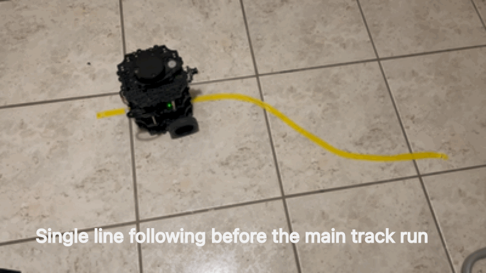

# Tutoriels de suivi de ligne et de piste pour le TurtleBot3

*[English version here](README.md)*

Ce dépôt propose des tutoriels **ROS 2 Humble** pour le **TurtleBot3** : de l'installation rapide du robot jusqu'au suivi de ligne et de piste par caméra en Python.

## Tutoriels

1. [**Installation rapide**](Quick_installation_fr.md) : configurer le PC et le TurtleBot3, avec en option une image de carte SD prête à l'emploi pour la Raspberry Pi.
2. [**Suivi de ligne et de piste**](Line_track_following_fr.md) : diffuser le flux de la caméra vers le PC, détecter une ligne de couleur, puis suivre une ligne ou une piste formée de deux lignes (mission URMRC).

Les scripts Python du tutoriel de suivi de ligne et de piste se trouvent dans le dossier [src/](src/).

Une version PDF de chaque tutoriel et guide est disponible dans le dossier [pdf/](pdf/).

---

### Guides complémentaires (en anglais)

- [Back up and restore the TurtleBot3 SD card](BackupRestore_SDCard.md)
- [Battery management (LiPo safety, charging, storage)](BatteryOperation.md)

### Prérequis

- Un TurtleBot3 Burger équipé d'une caméra Raspberry Pi montée à l'avant
- Un PC sous Ubuntu 22.04 avec ROS 2 Humble
- Un réseau Wi-Fi partagé par le PC et le robot

### Ressources externes

- Tutoriels officiels ROS 2 Humble :
    - [Beginner: CLI Tools](https://docs.ros.org/en/humble/Tutorials/Beginner-CLI-Tools.html) (**fortement recommandé** avant de commencer)
    - [Beginner: Client Libraries](https://docs.ros.org/en/humble/Tutorials/Beginner-Client-Libraries.html)
    - [Intermediate: Launch Files](https://docs.ros.org/en/humble/Tutorials/Intermediate/Launch/Launch-Main.html)
- [Autonomous driving](https://docs.robotis.com/docs/systems/turtlebot3/autonomous_driving/) dans le manuel Robotis : ressources et code ROS 2 Humble pour des missions proches des missions URMRC.
    - Dépôt associé : [ROBOTIS-GIT/turtlebot3_autorace](https://github.com/ROBOTIS-GIT/turtlebot3_autorace)
- Tout tutoriel ou cours sur les bases de la ligne de commande Linux

---

### Licence

Ce travail est placé sous la [licence Creative Commons Attribution 4.0 International (CC BY 4.0)](https://creativecommons.org/licenses/by/4.0/deed.fr) : vous pouvez le partager et l'adapter à toutes fins, à condition de créditer l'auteur (Loïc Cuvillon), de fournir un lien vers la licence et d'indiquer si des modifications ont été effectuées. Voir le fichier [LICENSE](LICENSE) pour le texte complet.

Exception : l'image de l'espace colorimétrique HSV ([assets/HSV.png](assets/HSV.png)) n'est pas couverte par cette licence ; tous les droits restent à ses auteurs.
